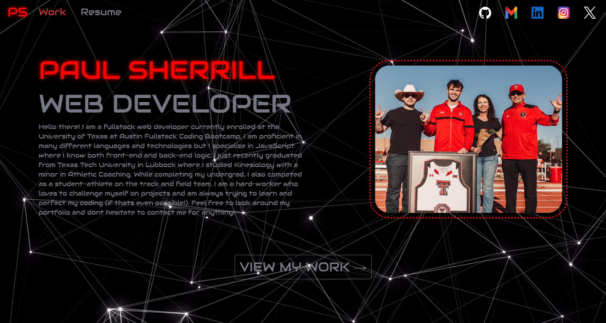
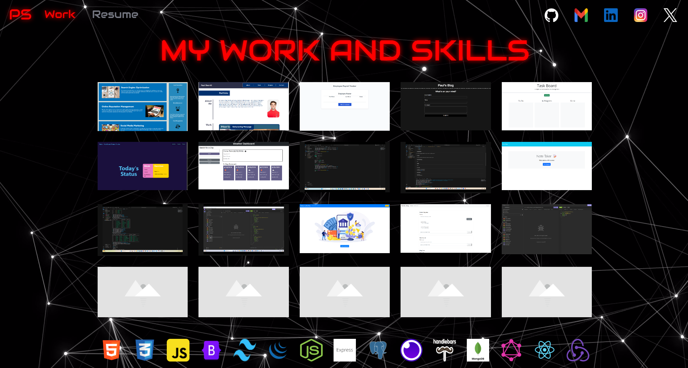
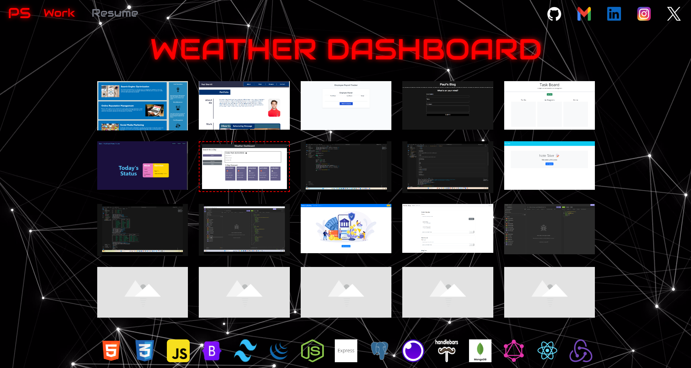
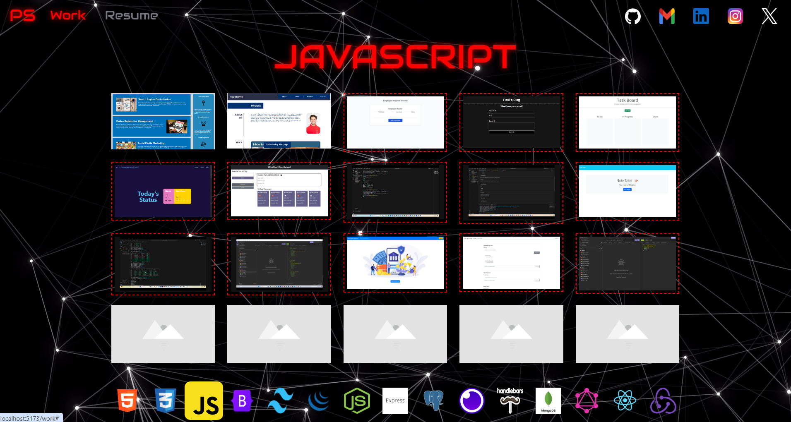
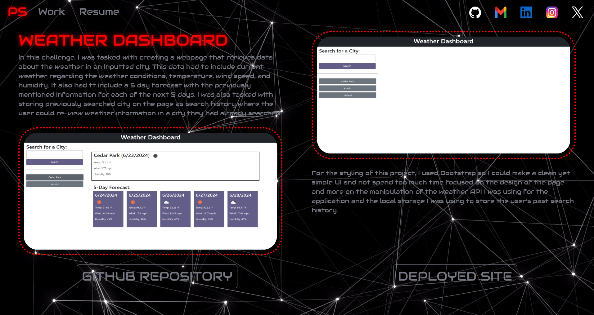

# Express.js Note Taker

## Description

For this assignment, I was tasked with building a front-end portfolio application to display my work and information as a full-stack developer. I was tasked with using React.js to build a single HTML file to build on top of for the entire application.

## Installation

Before writing the actual code, I began by installing react and building my file structure. I began by creating the initial html file with a proper heading containing all of my styling links. I then added a background mp4 to be displayed as the background for every page and then added a div element with root as the class to put my react components in. For the jsx files, I started by building a main file to put all of the different compnents and add routes to each one. I then created the App file to add the heading components above those pages.

From there, I started working on the header component. I added the nav elements which included links to an about, work, and resume page, as well as links to my github, gmail, and other social medias. I then added styling to those elements in the index.css file that was to be the styling file for the entire application. After that, I started working on the about page which just included basic HTML with information about me, a photo, and a link to click to go to view the work page. For the work page, I started by setting up the basic HTML strucutre for what I wanted the page to look like. I then created project and skills data to be pulled and mapped to display all of it. From there, I wanted to add logic that made it so that when a skill is hovered over, it highlights the projects where that skill is utilized. I did so by adding classes that matched between the projects and skills and added a conditional function for when the classes match, the projects elements would be highlighted. After that, I added a repos page that would display a repo with photos and information depending on the repo ID pulled from the work page and used as the URL. I then created the resume page that displayed my resume by creating it using HTML and then added a download button that would download it as a PDF file when clicked.

After my application was running how I wanted it to, the last step was to add logic back to the nav bar so that the nav links would be red when they were the current page. I did this by adding conditional ternaries to each one that added the correct styling. Then I was done!

## Usage

To use the deployed website click https://note-taker-6sn5.onrender.com/

Once you are there, you will be taken to the about page which is the default page. You will see a navbar with links to other pages and ways to contact me. On the page, you will see my name with text about me and a photo. You will also see a button that will take you to my work.

When that button or the nav link "work" is clicked, you will be taken to a new page where you will see project photos and skills icons.

When a photo is hovered over, the title of the page will be replaced with the title of that project.

When a skill is hovered over, the title will be replaced with the name of that skill and the projects that utilize that skill will be highlighted.

You will also notice that the nav link "work" will be red because it is the current page. To go back to the about page, click on the "PS" (my initials). To view a specific project, click on that project. You will then be taken to another page with information and photos of that project, as well as links to the deployed site and github repository.

When the resume link in the navbar is clicked, it will take you to a page where you can view my resume and a button that downloads a PDF of my resume. You will also notice the nav link "resume" is red because it is the current page.

